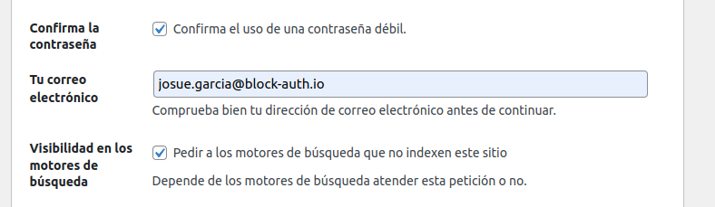
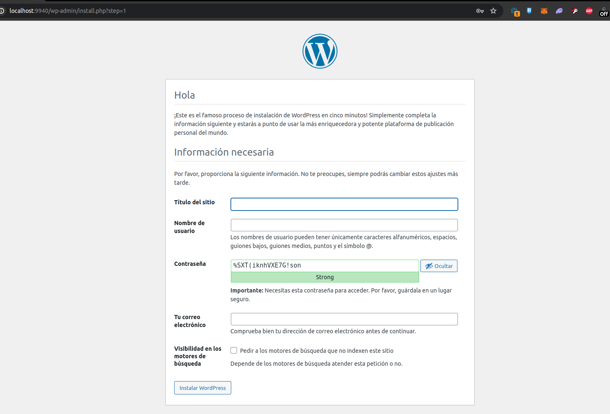

# SBG-Shutupgallery Landing

This is the landing page for the AD La Ferroviaria project. It is a wordpress site that is hosted on the [ferro-marketplace.es](https://landing.ferro-marketplace.es/) and [int-ferro-marketplace.es](https://int-landing.ferro-marketplace.es/) domain.


## Development

To run the site locally, you will need to have docker installed. Then you can run the following command to start the site:

1. Up environment with docker-compose:
```bash
docker compose -f docker-compose.dev.yml up -d --build
```
2. Completed the minimal installation : http://localhost:9940/wp-admin/install.php
3. Fill up the form in the image below:
    * Site Title: ```ADF - DEV```
    * Username: ```dev```
    * Password: ```dev```
    * 



4. Download last backup from sharepoint: NOT_AVAILABLE
5. Install plugins in src/plugins/ folder in order (IMPORTANT):
    * 1. all-in-one-wp-migration.6.77.zip
    * 2. all-in-one-wp-migration-unlimited-extension.zip
    * 3. YOAST-SEO-PREMIUM.zip
6. Restore the backup with the plugin "All-in-One WP Migration" in the left menu.

"Update has failed. The response is not a valid JSON response." To avoid this error, follow the steps below:

1. Enter the WordPress container:
```bash
docker exec -it landing-wp /bin/bash
```

2. Check the permissions of the .htaccess file:
```bash
ls -l /var/www/html/.htaccess
```

3. Change the permissions of the .htaccess file:
```bash
chmod 664 /var/www/html/.htaccess
```

4. Check the permissions of the /var/www/html directory:
```bash
ls -ld /var/www/html
```

5. Adjust the permissions of the /var/www/html directory:
```bash
chown www-data:www-data /var/www/html
```

6. Check the permissions of the .htaccess file again:
```bash
ls -l /var/www/html/.htaccess
```

7. Exit the container shell:
```bash
exit
```

8. Restart the WordPress container:
```bash
docker compose restart landing-wp
```

## Admin access

After installation, you can access the admin panel at [http://localhost:11000/wp-admin](http://localhost:11000/wp-admin) with the following credentials

url: ```shutupgallery.com/bakingg```
user: ```-```
pass: ```-```


## Important configuration files

You can download/upload files with the following commands:

### wp-config.php

```bash
docker cp sbg-shutupgallery-wp:/var/www/html/wp-config.php ./src/config/wp-config.php
vim wp-config.php # Edit the file
docker cp ./src/config/wp-config.php sbg-shutupgallery-wp:/var/www/html/wp-config.php
```

### php.ini

```bash
docker cp sbg-shutupgallery-wp:/usr/local/etc/php/php.ini-production ./src/config/php.ini
vim php.ini # Edit the file
docker cp ./src/config/php.ini sbg-shutupgallery-wp:/usr/local/etc/php/php.ini
```